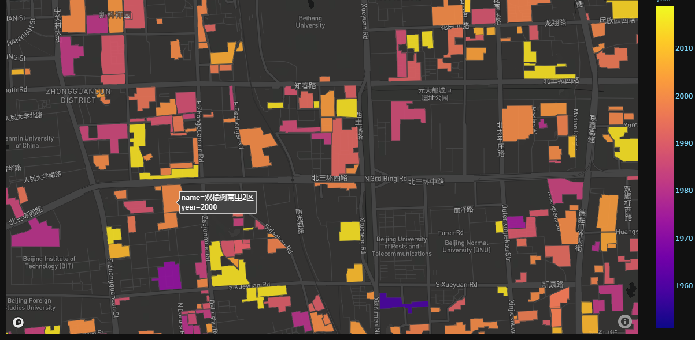

# Community Dashboard

This is the repository for the [Community Dashboard](https://dash-community.herokuapp.com/), an app mapping the contruction year of chinese communities.


## Requirements

* python==3.6.13

* gunicorn

* pandas==1.1.4

* dash==1.20.0

* dash_html_components==1.1.3

* plotly==4.14.3

* dash_core_components==1.16.0


## Preparation

- [ ] ### Data

* Community  AOIs (Area of Interests) with contruction year of 115 cities in China  (see `data_csv/city_scale.txt` ) are collected.
* All AOIs ('.shp') files are converted into  '.txt' and '.json' files.
* The **'.txt' files** ara saved in the diretory named **'data_csv'**.
* The **'.json' files** ara saved in the diretory named **'data_json'**.
* Relevant data for two cities (index:0, 1) are supplied in this repository for testing.


\* Noted that **not all communities are involved**, due to the restriction on data acquisition.


- [ ] ### Code

Complete codes are provided in `app.py`.

Before you can successfully run the program, you need to apply for an **accesstoken** from  [Mapbox](https://www.mapbox.com), and  add it at `Line 251`.

 


## Deploy

The app is deployed on [Heroku](https://dashboard.heroku.com/). 


> Firstly, to ensure a successful deployment, additional files need to be added into the repository:

* ` runtime.txt` 


* `requirements.txt`


* `Procfile`

* `.gitignore`

  ​

> Then deploy the app through Git Bash: 

```python
heroku login  # login your heroku first
git clone https://github.com/liumency/dash-community.git  # clone the repository
    
cd dash-sommunity 
heroku create dash-community
git add .
git commit -m 'My-commit-message'
git push heroku main
```


For more information about the deployment, please check the following **references**:

* [Getting Started on Heroku with Python](https://devcenter.heroku.com/articles/getting-started-with-python)

* [Deploying Dash or Flask web application on Heroku](https://towardsdatascience.com/deploying-dash-or-flask-web-application-on-heroku-easy-ci-cd-4111da3170b8)

  ​

## Dashboard Manual 

The **Community Dashboard** is available [here](https://dash-community.herokuapp.com/).

 


- ### Instruments

* Firstly, select a city from the Dropdown box. 
* Map styles and opacity are also adjustable for different visual effect.
* Then the **mapbox** would show the community of the selected city.
* The **histogram** counts the number of newly-built communities per year.

> ** It might take some time for initializatioin and update.


- ### Mapbox

1. The mapbox is updated in real time according to the selected city.

   Older communities are shown in darker color, while newer ones are shown in ligher color.

   

   ​

2. Scroll to enlarge the map to check details of each community, including **name** and **year**.

   

   ​

3. Change view by pressing the `Ctrl` and pulling the map with the left mouse button. 

   


- ### Histogram 

  ### 


* The number of newly-built communities per year are summarized in the histogram.


* **Total** denotes the <u>total number</u> of communities being counted and displayed.
* Noted that **not all communities are involved**, due to the restriction on data acquisition.


### 

